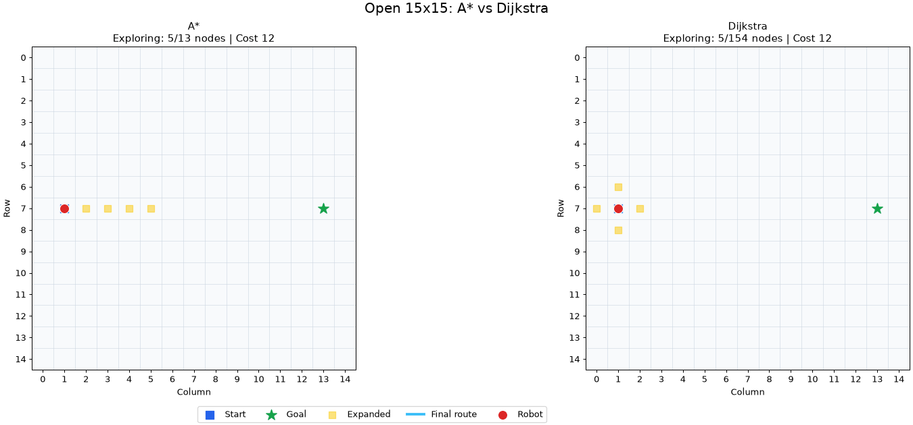
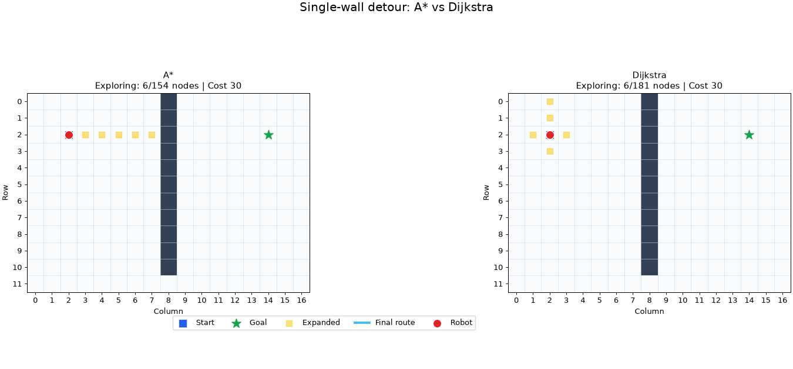
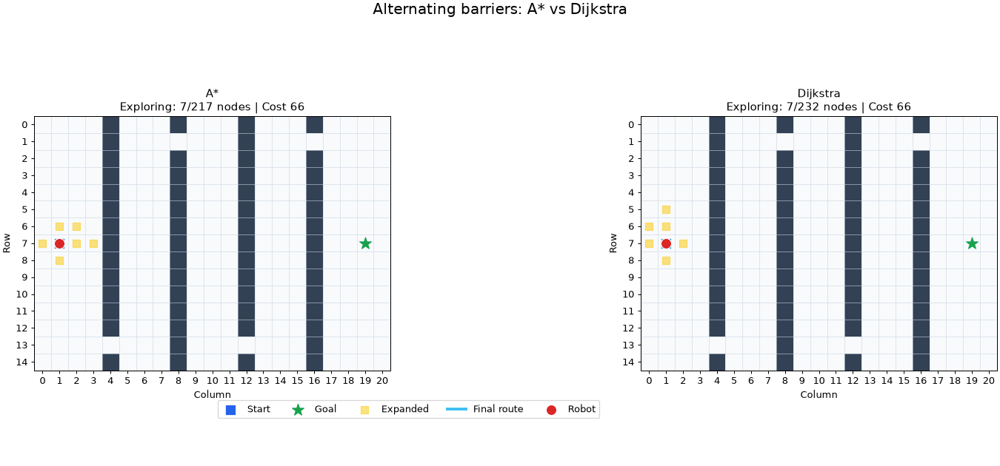

# Question 1: Search Analysis

## Method

A* Search and Dijkstra Search were run on the same configurations. Both
algorithms return a route, its total cost, and the number of states expanded.
A state is counted when it is removed from the priority queue for processing;
outdated duplicate entries are not counted. The goal state is included in the
count.

For Robot Navigation, every legal movement costs 1 and A* uses Manhattan
distance. For Courier Delivery, an edge costs road distance multiplied by its
road-type penalty: Main Road = 1, Standard Road = 2, and Narrow Lane = 3. A*
uses aerial distance to the destination, while Dijkstra uses no heuristic.

## Robot Navigation Results

Coordinates use the `(row, column)` format and start at zero.

| Configuration | Grid and endpoints |
|---|---|
| Open 15x15 | No obstacles; start `(7, 1)`, goal `(7, 13)` |
| Single-wall detour | 12x17 grid; vertical wall in column 8 with its only gap in row 11; start `(2, 2)`, goal `(2, 14)` |
| Alternating barriers | 15x21 grid; walls in columns 4, 8, 12, and 16 with alternating gaps; start `(7, 1)`, goal `(7, 19)` |

| Configuration | Algorithm | Cost | Nodes expanded | Route |
|---|---:|---:|---:|---|
| Open 15x15 | A* | 12 | 13 | Right x12 |
| Open 15x15 | Dijkstra | 12 | 154 | Right x12 |
| Single-wall detour | A* | 30 | 154 | Right x5, Down x9, Right x2, Up x9, Right x5 |
| Single-wall detour | Dijkstra | 30 | 181 | Down x9, Right x7, Up x9, Right x5 |
| Alternating barriers | A* | 66 | 217 | Right x2, Down x6, Right x2, Up x6, Right x2, Up x6, Right x2, Down x6, Right x2, Down x6, Right x2, Up x6, Right x2, Up x6, Right x2, Down x6, Right x2 |
| Alternating barriers | Dijkstra | 66 | 232 | Down x6, Right x4, Up x12, Right x4, Down x12, Right x4, Up x12, Right x4, Down x6, Right x2 |

The two algorithms found equal optimal costs in all three configurations. More
than one optimal route can exist, which explains why their action sequences
sometimes differ despite having the same cost.

On the open grid, Manhattan distance points directly toward the goal, so A*
expanded 13 states compared with Dijkstra's 154, a reduction of approximately
91.6%. The single wall forces a long detour that Manhattan distance cannot
predict, reducing A*'s advantage to approximately 14.9%. With alternating
barriers, the heuristic ignores several forced detours and the reduction falls
to approximately 6.5%. This shows that A* benefits most when its heuristic
closely represents the actual remaining path cost.

## Courier Delivery Results

| Configuration | Algorithm | Cost | Nodes expanded | Route |
|---|---:|---:|---:|---|
| Saddar to Korangi | A* | 34.0 | 13 | Saddar (Hub) -> Clifton -> DHA -> Korangi |
| Saddar to Korangi | Dijkstra | 34.0 | 15 | Saddar (Hub) -> Clifton -> DHA -> Korangi |
| Lyari to Johar | A* | 38.0 | 8 | Lyari -> Saddar (Hub) -> PECHS -> Gulshan-e-Iqbal -> Gulistan-e-Johar |
| Lyari to Johar | Dijkstra | 38.0 | 12 | Lyari -> Saddar (Hub) -> PECHS -> Gulshan-e-Iqbal -> Gulistan-e-Johar |
| Orangi to DHA | A* | 57.0 | 16 | Orangi Town -> SITE Area -> Nazimabad -> Liaquatabad -> Saddar (Hub) -> Clifton -> DHA |
| Orangi to DHA | Dijkstra | 57.0 | 16 | Orangi Town -> SITE Area -> Nazimabad -> Liaquatabad -> Saddar (Hub) -> Clifton -> DHA |
| North Nazimabad to Malir | A* | 25.0 | 6 | North Nazimabad -> FB Area -> Gulshan-e-Iqbal -> Malir |
| North Nazimabad to Malir | Dijkstra | 25.0 | 10 | North Nazimabad -> FB Area -> Gulshan-e-Iqbal -> Malir |

Both algorithms again found the same optimal cost and route. A* expanded fewer
states in three of the four cases. Its largest reduction was 40% for North
Nazimabad to Malir. For Orangi to DHA, both expanded 16 states, so the heuristic
provided no measurable benefit on that route.

Aerial distance gives A* a useful estimate of geographic closeness, but it does
not represent missing direct roads or the extra penalties for Standard Roads
and Narrow Lanes. Consequently, its benefit varies by route. Dijkstra remains
uninformed and expands locations according only to accumulated route cost.
The results show that both algorithms preserve optimal solution cost, while A*
usually reduces the search effort when the heuristic reflects the road network
well.

## Route with Stopovers (Question 1(d))

For a multi-package run, the hub and unique stopovers are treated as important
route points. A* first calculates the shortest path between every ordered pair
of these points. The algorithm then tests every possible stopover order, adds
the stored segment costs including the return to the hub, and retains the
lowest-cost reachable order. Finally, it joins the corresponding A* segments
to produce one complete route.

The courier and robot heuristics accept an optional temporary goal. Normal A*
still uses the problem's original goal, while each stopover segment estimates
distance to its own destination.

### Pseudocode

```text
SEARCH-WITH-STOPOVERS(problem, stopovers):
    hub = problem's start state
    remove duplicate stopovers and remove the hub from the stopover list

    IF there are no stopovers:
        RETURN empty path, zero cost, empty order

    points = [hub] + stopovers

    FOR every ordered pair (start, goal) in points:
        path, cost = A-STAR(problem, temporary start, temporary goal)
        store path and cost for (start, goal)

    bestCost = infinity
    bestOrder = none

    FOR every permutation of stopovers:
        order = [hub] + permutation + [hub]

        IF every consecutive pair in order is reachable:
            cost = sum of stored costs between consecutive locations

            IF cost < bestCost:
                bestCost = cost
                bestOrder = order

    IF no complete order is reachable:
        report that no valid delivery run exists

    completePath = join the stored A* paths along bestOrder
    RETURN completePath, bestCost, and the visited stopover order
```

Testing all permutations gives the exact best order for a small delivery run.
For `m` unique stopovers, it performs `m!` order comparisons after the pairwise
A* searches, so a different ordering method would be preferable for a large
number of packages.

### Example Result

The included example starts and ends at Saddar and intentionally supplies the
stopovers in a non-optimal order:

```text
Requested stopovers: Korangi -> Gulistan-e-Johar -> Clifton
Optimized stopover order: Gulistan-e-Johar -> Korangi -> Clifton
Complete route: Saddar (Hub) -> PECHS -> Gulshan-e-Iqbal -> Gulistan-e-Johar -> Korangi -> DHA -> Clifton -> Saddar (Hub)
Total route cost: 75.0
Nodes expanded during pairwise A* searches: 69
```

This example can be reproduced from the `ai-hw` directory with:

```powershell
python .\code\stopoverDelivery.py
```

## Robot Navigation Simulations

The following optional animations compare A* and Dijkstra side by side. The
first phase highlights expanded states in yellow, making each algorithm's
search behavior visible. The second phase moves the red robot along the cyan
optimal route returned by that algorithm. The blue square is the start, the
green star is the goal, and dark cells are obstacles. Each panel reports the
route cost and expansion progress.

### Open Grid



### Single-Wall Detour



### Alternating Barriers



The animations can be regenerated from the `ai-hw` directory with:

```powershell
python .\code\robotSimulation.py
```

The earlier A*-only route animations remain in `robotSimulations/`. Run the
generator with `--mode solo` for only those versions or `--mode all` to create
both animation styles.

The experiments can be reproduced by running:

```powershell
python .\code\comparativeAnalysis.py
```
