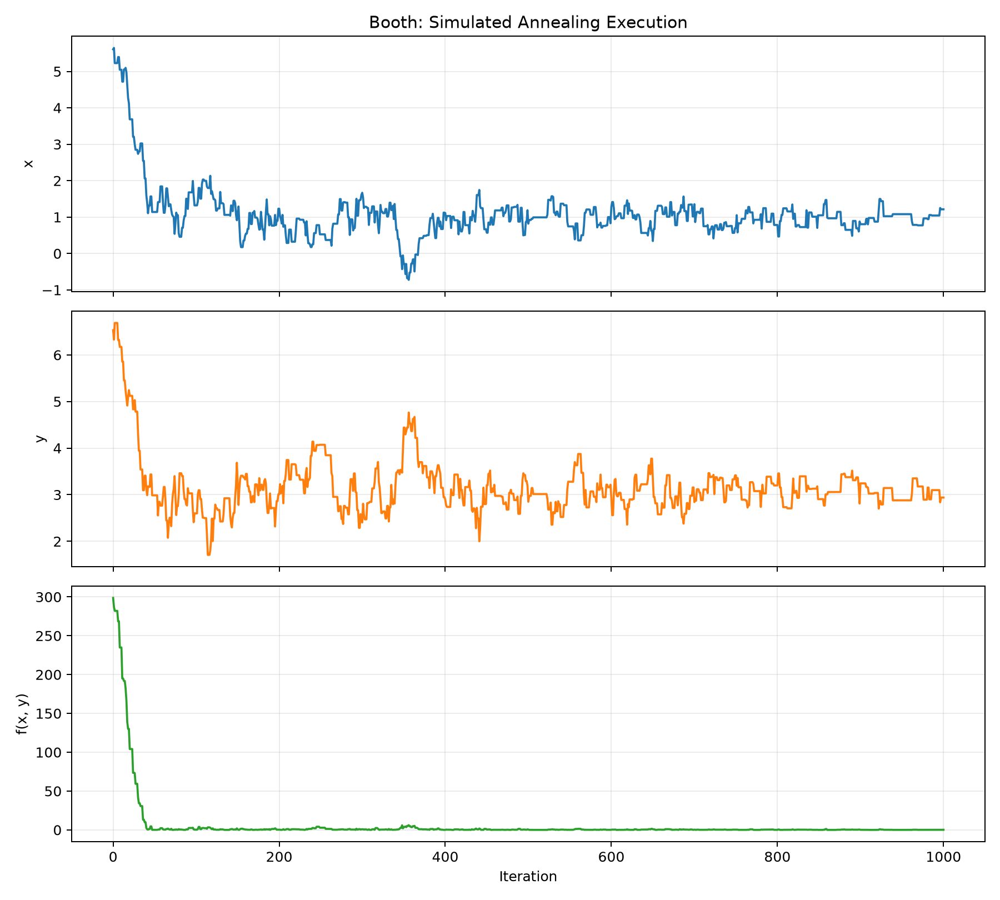
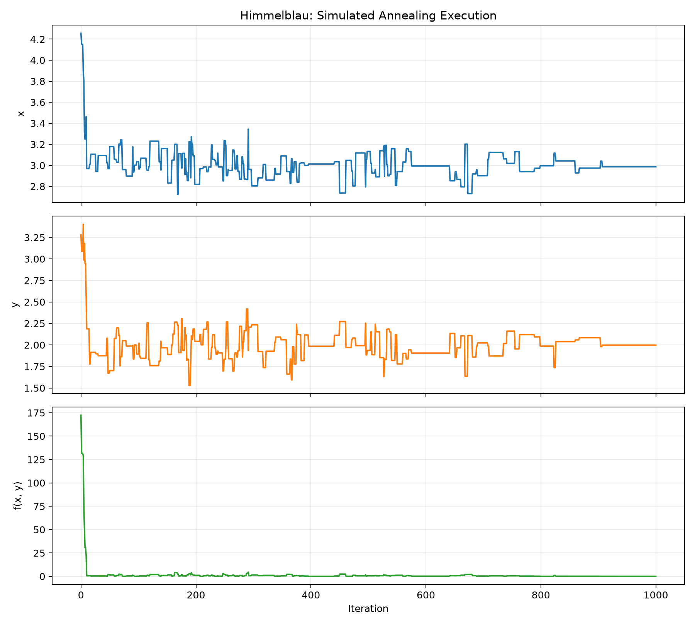

# Question 2: Optimization Using Simulated Annealing

## Problem Formulation

A state is a pair of real values `(x, y)` inside the function's stated
domain. A neighboring state is produced by independently adding a random
value from `[-neighborhoodSize, neighborhoodSize]` to `x` and `y`. Values
outside the domain are moved back to the nearest boundary.

For minimization, a candidate with a lower function value is always accepted.
A worse candidate with increase `delta` may still be accepted with probability

```text
P(accept) = exp(-delta / temperature)
```

This allows the search to escape local minima while the temperature is high.
As the temperature decreases, accepting worse moves becomes less likely. The
implementation also supports maximization by reversing the comparison.

## Pseudocode

```text
SIMULATED-ANNEALING(function, bounds, parameters):
    current = random point within bounds
    best = current
    temperature = starting temperature

    WHILE temperature > 0:
        REPEAT K times:
            candidate = random neighbor of current
            clamp candidate to the function bounds
            delta = function(candidate) - function(current)

            IF delta <= 0:
                accept candidate
            ELSE:
                probability = exp(-delta / temperature)
                accept candidate with that probability

            IF candidate was accepted:
                current = candidate

            IF function(current) < function(best):
                best = current

            record x, y, and function(current)

        decrease temperature

    RETURN best point, best value, and recorded history
```

## Parameters and Tuning

Twenty seeded restarts were used for each function because simulated annealing
is stochastic. The best run was retained for reporting and plotting.

| Function | Neighborhood | Starting T | T decrease | K | Iterations per run |
|---|---:|---:|---:|---:|---:|
| Booth | 0.5 | 1.0 | 0.1 | 100 | 1,000 |
| Himmelblau | 0.5 | 1.0 | 0.1 | 100 | 1,000 |
| Griewank | 0.5 | 1.0 | 0.01 | 300 | 30,000 |

The assignment's initial parameters worked well for Booth and Himmelblau.
With those parameters, Griewank became trapped near a local minimum and its
best value was approximately `0.007613`. Griewank has many regularly spaced
local minima, so slower cooling and more iterations per temperature were
tested. The tuned schedule reduced the best value to approximately
`0.00000339`.

## Results

| Function | Best x | Best y | Best value | Known global minimum |
|---|---:|---:|---:|---|
| Booth | 0.996236 | 3.003445 | 0.0000264458 | `f(1, 3) = 0` |
| Himmelblau | 3.000811 | 2.000224 | 0.0000288092 | `f(3, 2) = 0` |
| Griewank | -0.002559 | -0.000679 | 0.0000033907 | `f(0, 0) = 0` |

The results are very close to the known global minima. Small nonzero errors
are expected because simulated annealing samples continuous values randomly
and does not use derivatives to move exactly onto the optimum.

Himmelblau's function has four global minima with value zero. The reported run
converged near `(3, 2)`; convergence near any of the other three global minima
would also be correct.

## Execution Plots

Each figure shows the current `x`, `y`, and `f(x, y)` values over the iterations
of the best seeded run.

### Booth Function



### Himmelblau Function



### Griewank Function


The large early changes show exploration at higher temperatures. Later values
become more concentrated as the temperature decreases. The Griewank plot is
longer because its slower cooling schedule was needed to navigate its many
local minima.

## Running the Program

From the `ai-hw` directory:

```powershell
python -m pip install -r requirements.txt
python .\code\simulatedAnnealing.py
```

The program prints the best values and recreates all three figures in the
`plots` directory. The default random seed makes the submitted results
reproducible.
