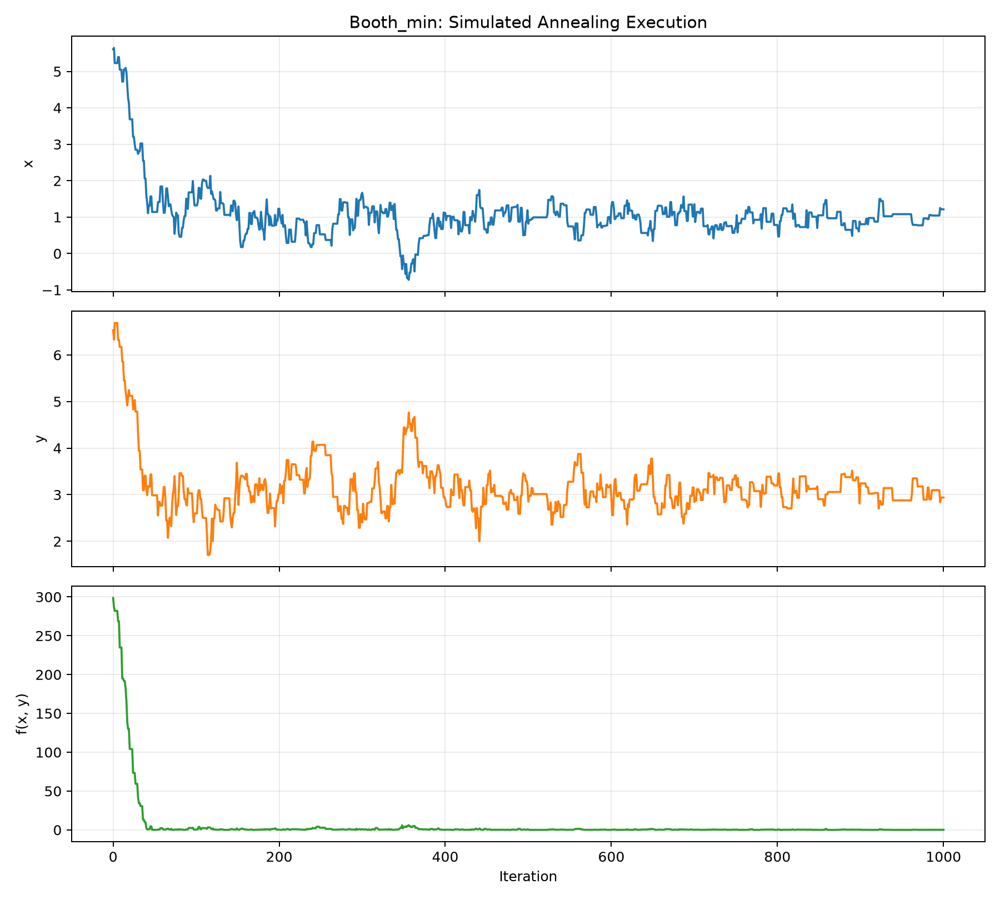
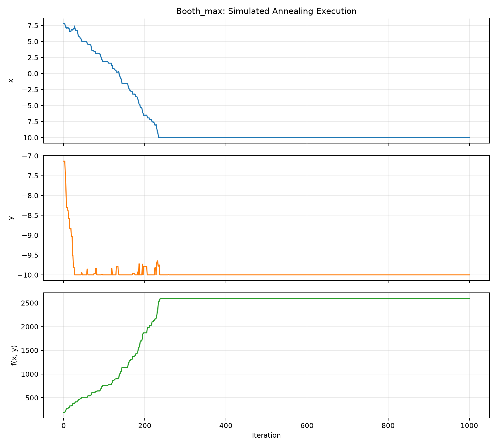
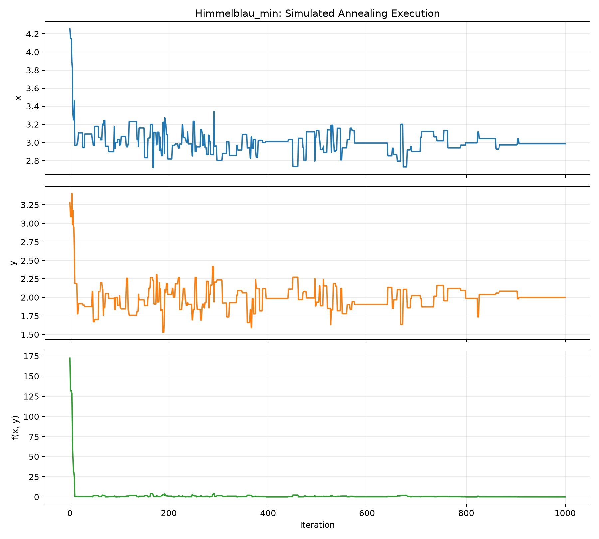
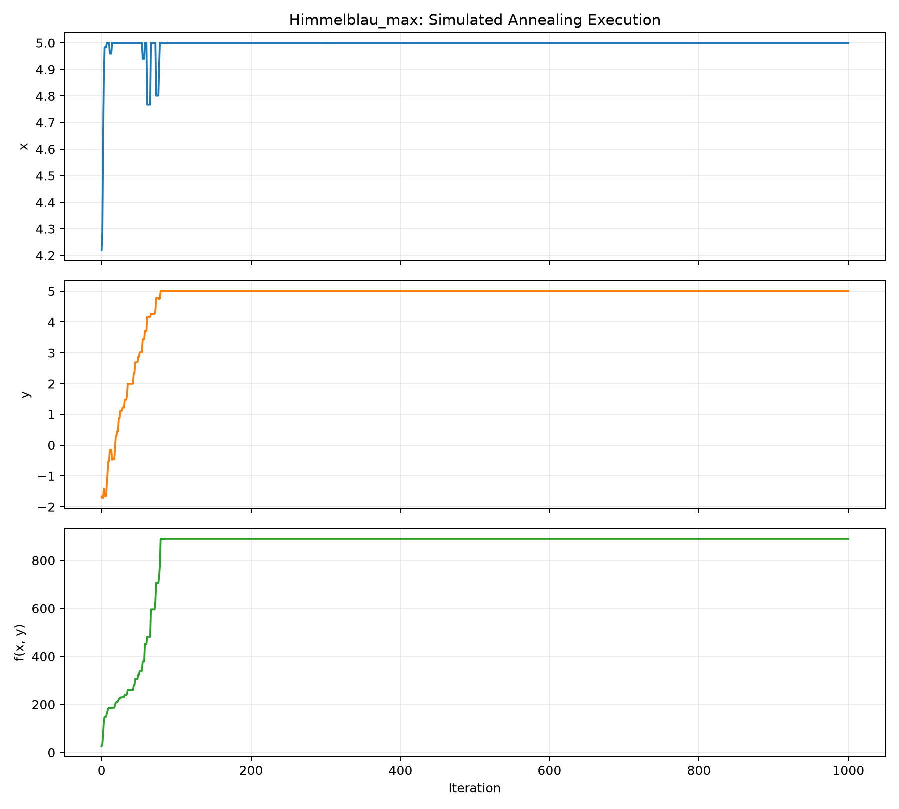
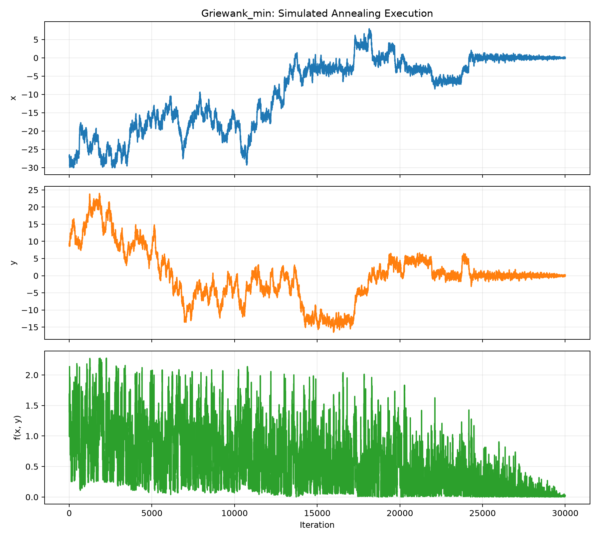
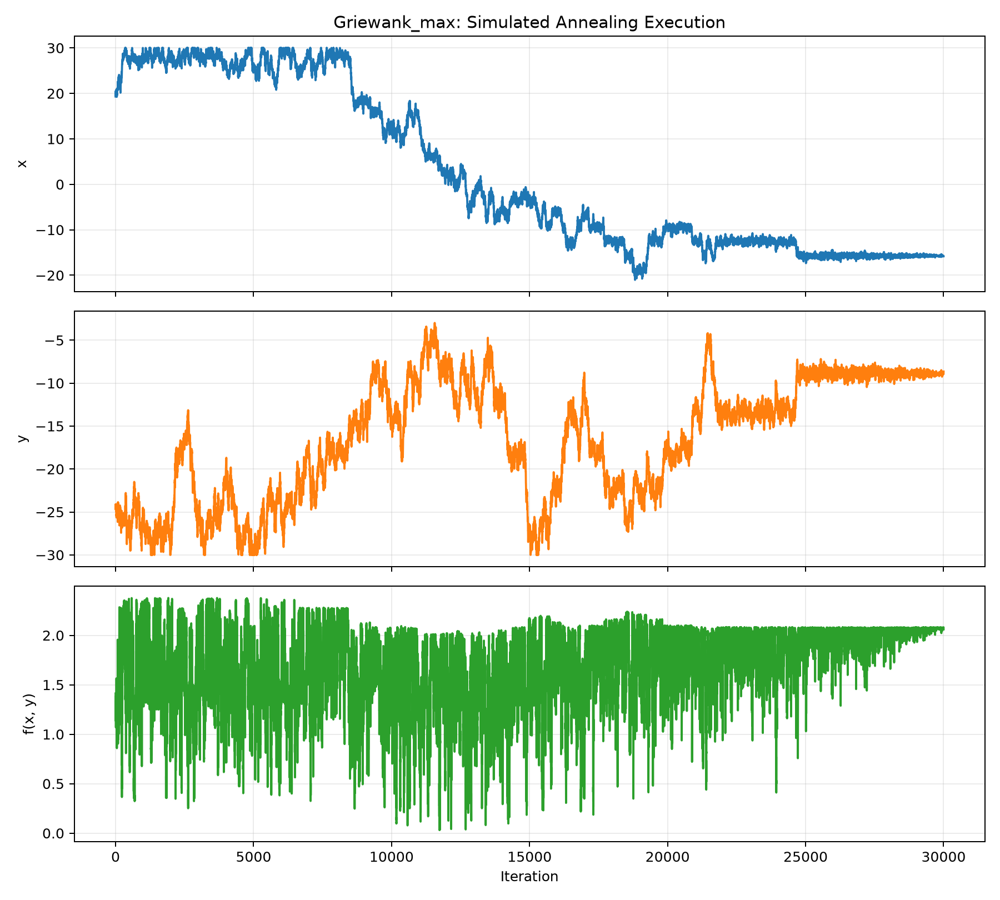

# Question 2: Optimization Using Simulated Annealing

## Problem Formulation

A state is a pair of real values `(x, y)` inside the function's stated
domain. A neighboring state is produced by independently adding a random
value from `[-neighborhoodSize, neighborhoodSize]` to `x` and `y`. Values
outside the domain are moved back to the nearest boundary.

For minimization, a candidate with a lower function value is always accepted;
for maximization, a candidate with a higher value is always accepted. A move
that worsens the selected objective may still be accepted with probability

```text
P(accept) = exp(-delta / temperature)
```

This allows the search to escape local optima while the temperature is high.
As the temperature decreases, accepting worse moves becomes less likely. For
maximization, the implementation reverses the sign of `delta`, allowing the
same acceptance rule to work for both objectives.

## Pseudocode

```text
SIMULATED-ANNEALING(function, bounds, objective, parameters):
    current = random point within bounds
    best = current
    temperature = starting temperature

    WHILE temperature > 0:
        REPEAT K times:
            candidate = random neighbor of current
            clamp candidate to the function bounds
            delta = function(candidate) - function(current)

            IF objective is MAXIMIZE:
                delta = -delta

            IF delta <= 0:
                accept candidate
            ELSE:
                probability = exp(-delta / temperature)
                accept candidate with that probability

            IF candidate was accepted:
                current = candidate

            IF current improves best for the selected objective:
                best = current

            record x, y, and function(current)

        decrease temperature

    RETURN best point, best value, and recorded history

FIND-BEST-RUN(...):
    run SIMULATED-ANNEALING several times with consecutive seeds
    IF objective is MINIMIZE:
        return the result with the smallest best value
    ELSE:
        return the result with the largest best value
```

## Parameters and Tuning

Twenty seeded restarts were used for every function and objective because
simulated annealing is stochastic. Consecutive seeds make the experiments
independent but exactly reproducible. The lowest-valued run is retained for
minimization and the highest-valued run for maximization.

| Function | Neighborhood | Starting T | T decrease | K | Iterations per run |
|---|---:|---:|---:|---:|---:|
| Booth | 0.5 | 1.0 | 0.1 | 100 | 1,000 |
| Himmelblau | 0.5 | 1.0 | 0.1 | 100 | 1,000 |
| Griewank | 0.5 | 1.0 | 0.01 | 300 | 30,000 |

The assignment's initial parameters worked well for Booth and Himmelblau.
With those parameters, Griewank became trapped near a local minimum and its
best value was approximately `0.007613`. Griewank has many regularly spaced
local minima, so slower cooling and more iterations per temperature were
tested. The tuned schedule reduced the best value to approximately
`0.00000339`.

## Results

| Function | Objective | Best x | Best y | Best value | Reference value |
|---|---:|---:|---:|---:|---|
| Booth | Minimum | 0.996236 | 3.003445 | 0.0000264458 | `f(1, 3) = 0` |
| Himmelblau | Minimum | 3.000811 | 2.000224 | 0.0000288092 | `f(3, 2) = 0` |
| Griewank | Minimum | -0.002559 | -0.000679 | 0.0000033907 | `f(0, 0) = 0` |
| Booth | Maximum | -10.000000 | -10.000000 | 2594.0000000000 | `f(-10, -10) = 2594` |
| Himmelblau | Maximum | 5.000000 | 5.000000 | 890.0000000000 | `f(5, 5) = 890` |
| Griewank | Maximum | 28.285932 | -26.683218 | 2.3777868106 | Best observed seeded result |

The minimum results are very close to the known global minima. Small nonzero
errors are expected because simulated annealing samples continuous values
randomly and does not use derivatives to move exactly onto an optimum. The
Booth and Himmelblau maximum runs reached their boundary maxima exactly. The
Griewank result is reported as the best observed seeded value because its
oscillating surface has many competing local extrema.

Himmelblau's function has four global minima with value zero. The reported run
converged near `(3, 2)`; convergence near any of the other three global minima
would also be correct.

## Execution Plots

Each figure shows the current `x`, `y`, and `f(x, y)` values over the iterations
of the best seeded run for the stated objective. The history records the
current state rather than the best-so-far state, so temporary movement in the
wrong direction demonstrates simulated annealing's probabilistic exploration.

### Booth Function — Minimum



### Booth Function — Maximum



### Himmelblau Function — Minimum



### Himmelblau Function — Maximum



### Griewank Function — Minimum



### Griewank Function — Maximum



The large early changes show exploration at higher temperatures. Later values
become more concentrated as the temperature decreases. Griewank's plots are
longer and denser because its cosine terms create many local extrema and its
slower cooling schedule records 30,000 iterations instead of 1,000.

The earlier plots in `plots/` have intentionally been retained as rough-work
evidence of the initial experiments. The corrected final plots are in
`newPlots/` and are the figures referenced above.

## Running the Program

From the `ai-hw` directory:

```powershell
python -m pip install -r requirements.txt
python .\code\simulatedAnnealing.py
```

The program prints the best minimum and maximum values and recreates all six
final figures in the `newPlots` directory. The default random seed makes the
submitted results reproducible. A different destination can be selected with
the `--output-directory` argument.
